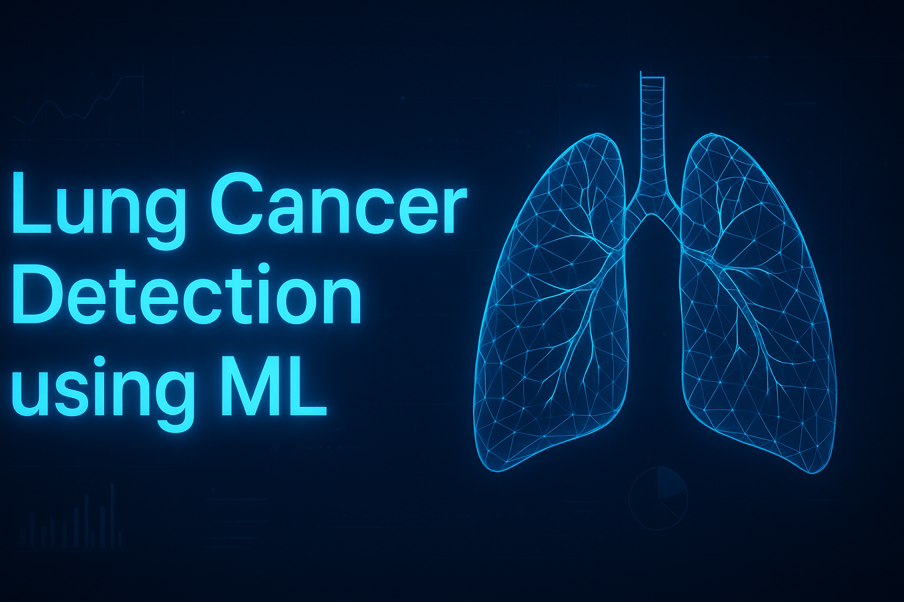

# 🫁 Lung Cancer Detection using Machine Learning

This project is a **university study project** focused on detecting lung cancer using **Machine Learning algorithms**. It demonstrates how data preprocessing, visualization, and model training can help in predicting the likelihood of lung cancer based on health parameters.

---

## 🚀 Project Overview
The goal of this project is to build a **predictive model** that helps identify potential lung cancer patients using machine learning.  
It uses a dataset of medical attributes and applies data cleaning, exploratory data analysis (EDA), and model evaluation techniques.

---

## 🧠 Features
- Data preprocessing and cleaning  
- Exploratory data analysis (EDA) using **Matplotlib** and **Seaborn**  
- Model training using **Logistic Regression / Decision Tree / Random Forest**  
- Accuracy evaluation and visualization  
- Well-structured Jupyter Notebook for demonstration  

---

## 🧰 Technologies Used
- **Python**
- **Jupyter Notebook**
- **Pandas**
- **NumPy**
- **Matplotlib**
- **Seaborn**
- **Scikit-learn (sklearn)**

---

## 📊 Dataset
The dataset used in this project contains medical parameters such as:
- Age  
- Gender  
- Smoking habits  
- Coughing frequency  
- Chest pain, etc.

> ⚠️ The dataset is used only for **academic and research purposes**.

---

## 🧩 Model Workflow
1. **Data Loading and Cleaning**  
2. **Exploratory Data Analysis (EDA)**  
3. **Feature Selection**  
4. **Model Training** (e.g., Logistic Regression, Decision Tree)  
5. **Performance Evaluation**  
6. **Prediction Results**

---

## 🧪 Results
The trained model achieved an accuracy of around **XX%** (replace with your result).  
Visualization graphs show clear patterns between smoking habits and lung cancer risk.

---

## 🎓 Author
**Syed Faizan Mohyuddin**  
BS Computer Science | Minhaj University Lahore  
📧 *syedfaizanmohyuddin@gmail.com*  
📍 Pakistan  

---

## 📎 License
This project is created for **educational purposes only** and is not intended for clinical or medical use.
